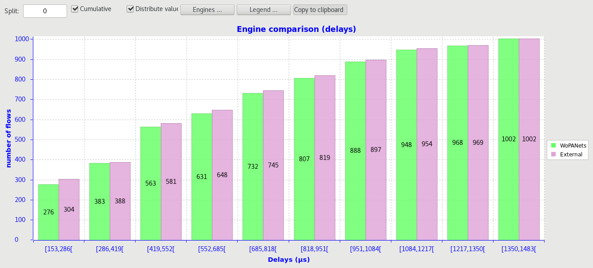
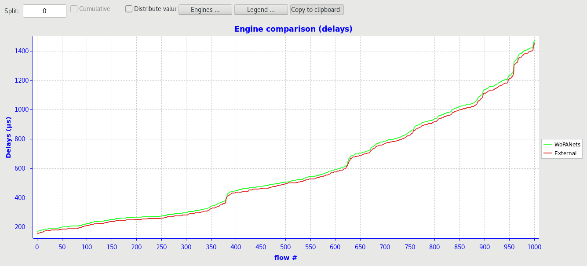
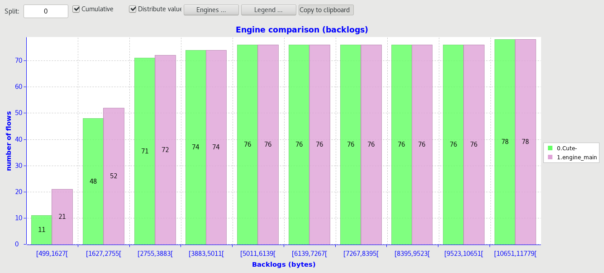
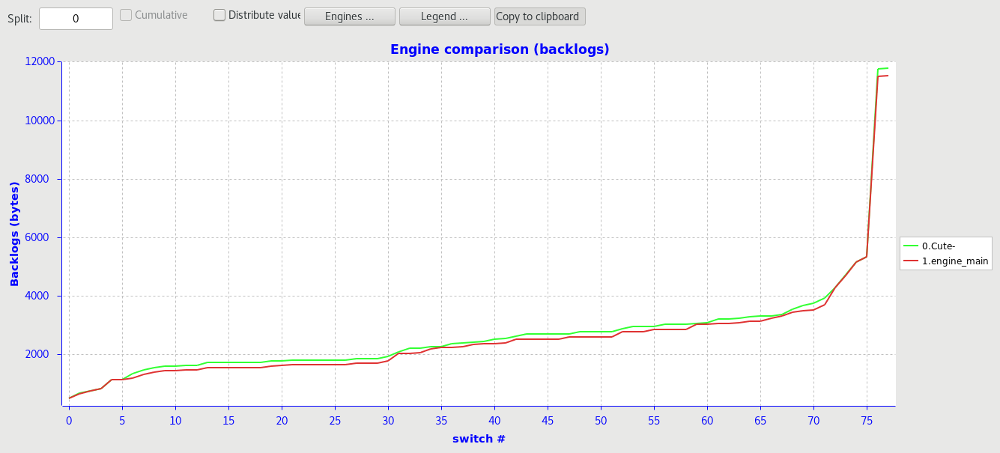

# wopanet-external-engine


Plugin for wopanets tool to analyze AFDX networks' end to end delays, backlogs, and links loads.


## Features

- The switching technique is hard-coded as "cut-through".

- The service curves are hard-coded as C(t) curves (fifo buffers).


## Usage

From  WoPANets GUI :

- Put the content of this repo into ~/Documents/WoPANets/external/

-  Launch WoPANets

- Tools > Custom Analysis > Calculation : ExternCalcul > engine_main.py


From command line : 

```
python3 engine_main.py ./input/<afdx_file_name>.xml
```

#### Warning : 

The input units shall be as follow : 

- Capacity : bits per second 
- Latency : microseconds
- Period : milliseconds
- Deadline : milliseconds


## Demo/Results

These results are obtained on the afdx.xml file (in the input folder)

Among of the reasons of the differences between the current engine and the WoPANets native engine is the fact that in the current engine the values of delays and backlogs are not ceiled.

### Delays




### Backlogs





## Authors

- [@Yacine BEN BELKACEM](https://github.com/Yacine-Benbelkacem)

